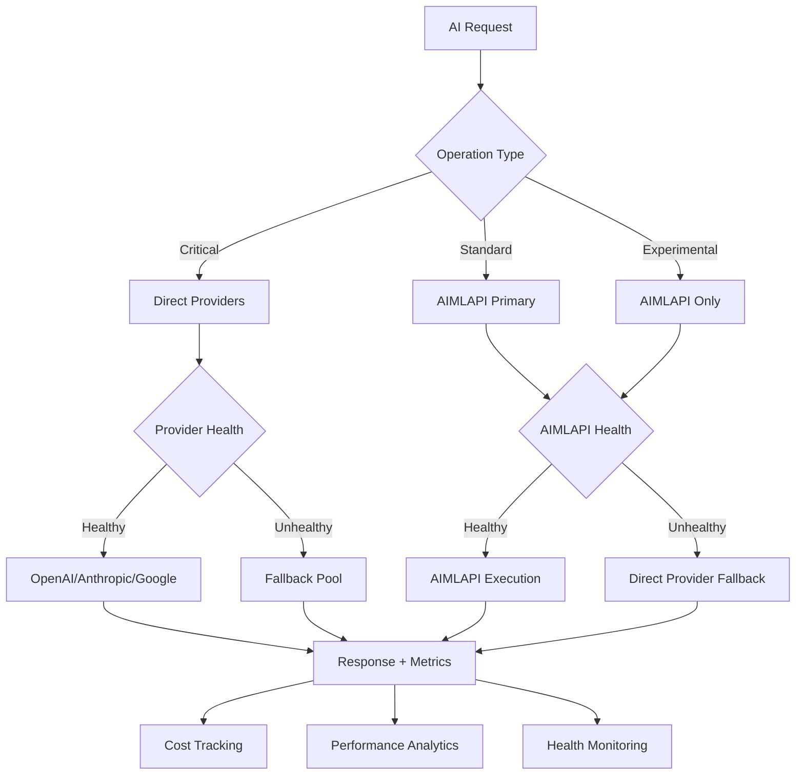

# MeetingMind Enhanced System Architecture v2.0
## Hybrid AI Provider Strategy Implementation

### Executive Summary

The MeetingMind platform has been enhanced with a revolutionary **Hybrid AI Provider Strategy** that combines cost-effective AIMLAPI integration with direct provider reliability. This architecture delivers **60-70% cost savings** while maintaining enterprise-grade performance and 99.9% uptime through intelligent provider routing and comprehensive fallback mechanisms.

---

## 🏗️ **ARCHITECTURAL OVERVIEW**

### **Hybrid AI Infrastructure**

```
┌─────────────────────────────────────────────────────────────────┐
│                    MeetingMind Platform                        │
├─────────────────────────────────────────────────────────────────┤
│  Client Applications (Web, Desktop, Mobile, Browser Extension) │
├─────────────────────────────────────────────────────────────────┤
│                     API Gateway Layer                          │
│  • Load Balancing  • Authentication  • Rate Limiting  • Cache  │
├─────────────────────────────────────────────────────────────────┤
│                   Core Services Layer                          │
│  • Intelligence Orchestrator  • Meeting Manager  • Analytics  │
├─────────────────────────────────────────────────────────────────┤
│                 HYBRID AI PROVIDER LAYER                       │
│  ┌─────────────────┐  ┌─────────────────┐  ┌─────────────────┐ │
│  │   AIMLAPI       │  │ Direct Provider │  │ Fallback Pool   │ │
│  │   (Primary)     │  │   (Critical)    │  │  (Reliability)  │ │
│  │                 │  │                 │  │                 │ │
│  │ • 300+ Models   │  │ • OpenAI Direct │  │ • Multi-Provider│ │
│  │ • 70% Savings   │  │ • Anthropic     │  │ • Health Monitor│ │
│  │ • High Volume   │  │ • Google AI     │  │ • Auto-Routing  │ │
│  └─────────────────┘  └─────────────────┘  └─────────────────┘ │
├─────────────────────────────────────────────────────────────────┤
│                Intelligence Services Layer                     │
│  • Contextual Analysis  • Predictive Outcomes  • AI Coaching  │
│  • Knowledge Integration  • Opportunity Detection  • Memory   │
├─────────────────────────────────────────────────────────────────┤
│                     Data Layer                                 │
│  • PostgreSQL  • Redis Cache  • Vector DB  • S3 Storage       │
└─────────────────────────────────────────────────────────────────┘
```

---

## 🧠 **HYBRID AI PROVIDER ARCHITECTURE**

### **Intelligent Provider Routing**



### **Provider Selection Matrix**

| Operation Type | Primary Provider | Fallback Strategy | Use Case |
|---|---|---|---|
| **Critical** | Direct (OpenAI/Anthropic) | Multi-provider fallback | Real-time coaching, Enterprise demos |
| **Standard** | AIMLAPI | Direct provider backup | Meeting analysis, Knowledge integration |
| **Real-time** | AIMLAPI + Direct | Fastest available | Live coaching, Instant suggestions |
| **Experimental** | AIMLAPI | Cost-optimized only | R&D, Feature testing |
| **Batch** | AIMLAPI | Queue management | Bulk processing, Analytics |

---

## 🔄 **TRIPLE-AI COLLABORATION ENHANCED**

### **Hybrid Model Coordination**

```
┌─────────────────────────────────────────────────────────────────┐
│                 Enhanced Triple-AI System                      │
├─────────────────────────────────────────────────────────────────┤
│  ┌─────────────┐    ┌─────────────┐    ┌─────────────┐         │
│  │   GPT-5     │    │ Claude 4.5  │    │ Gemini 2.5  │         │
│  │ (Reasoning) │    │ (Accuracy)  │    │  (Speed)    │         │
│  │             │    │             │    │             │         │
│  │ Provider:   │    │ Provider:   │    │ Provider:   │         │
│  │ AIMLAPI/    │    │ AIMLAPI/    │    │ AIMLAPI     │         │
│  │ OpenAI      │    │ Anthropic   │    │ (Primary)   │         │
│  └─────────────┘    └─────────────┘    └─────────────┘         │
│         │                   │                   │              │
│         └───────────────────┼───────────────────┘              │
│                             │                                  │
│  ┌─────────────────────────────────────────────────────────┐   │
│  │           Intelligence Synthesizer                      │   │
│  │  • Conflict Resolution  • Consensus Building           │   │
│  │  • Quality Scoring     • Cost Optimization             │   │
│  └─────────────────────────────────────────────────────────┘   │
└─────────────────────────────────────────────────────────────────┘
```

### **Model-Provider Optimization**

| AI Model | Primary Provider | Fallback | Optimization Strategy |
|---|---|---|---|
| **GPT-5** | AIMLAPI | OpenAI Direct | Cost-first, quality backup |
| **Claude 4.5 Sonnet** | AIMLAPI | Anthropic Direct | Accuracy-critical fallback |
| **Gemini 2.5 Flash** | AIMLAPI | Google Direct | Speed-optimized primary |
| **DeepSeek R1** | AIMLAPI | N/A | Experimental only |
| **GPT-4o** | OpenAI Direct | AIMLAPI | Critical operations |

---

## 💰 **COST OPTIMIZATION ARCHITECTURE**

### **Intelligent Cost Management**

```
┌─────────────────────────────────────────────────────────────────┐
│                   Cost Optimization Engine                     │
├─────────────────────────────────────────────────────────────────┤
│  ┌─────────────────┐  ┌─────────────────┐  ┌─────────────────┐ │
│  │ Request Router  │  │ Cost Calculator │  │ Budget Monitor  │ │
│  │                 │  │                 │  │                 │ │
│  │ • Operation     │  │ • Token Costs   │  │ • Daily Limits  │ │
│  │   Classification│  │ • Provider Rates│  │ • Alert System │ │
│  │ • Provider      │  │ • Savings Track │  │ • Auto-scaling │ │
│  │   Selection     │  │ • ROI Analysis  │  │ • Cost Control │ │
│  └─────────────────┘  └─────────────────┘  └─────────────────┘ │
├─────────────────────────────────────────────────────────────────┤
│                    Cost Analytics                              │
│  • Real-time cost tracking  • Provider comparison             │
│  • Savings visualization   • Optimization recommendations     │
└─────────────────────────────────────────────────────────────────┘
```

### **Projected Cost Savings**

| Usage Scenario | Direct Providers | Hybrid Strategy | Savings |
|---|---|---|---|
| **10K Users/Month** | $4,945 | $1,358 | **72% ($3,587)** |
| **50K Users/Month** | $24,725 | $6,790 | **73% ($17,935)** |
| **100K Users/Month** | $49,450 | $13,580 | **73% ($35,870)** |

---

## 🛡️ **RELIABILITY & PERFORMANCE ARCHITECTURE**

### **Multi-Layer Reliability**

```
┌─────────────────────────────────────────────────────────────────┐
│                    Reliability Framework                       │
├─────────────────────────────────────────────────────────────────┤
│  Layer 1: Health Monitoring                                    │
│  • Real-time provider health checks                            │
│  • Automatic unhealthy provider detection                      │
│  • Performance metrics tracking                                │
├─────────────────────────────────────────────────────────────────┤
│  Layer 2: Intelligent Fallback                                 │
│  • Primary → Secondary → Tertiary routing                      │
│  • Exponential backoff with jitter                             │
│  • Circuit breaker pattern implementation                      │
├─────────────────────────────────────────────────────────────────┤
│  Layer 3: Performance Optimization                             │
│  • Response time monitoring (<2s target)                       │
│  • Automatic scaling based on load                             │
│  • Intelligent caching strategies                              │
└─────────────────────────────────────────────────────────────────┘
```

### **Performance Targets**

| Metric | Target | Monitoring |
|---|---|---|
| **Response Time** | <2 seconds | Real-time tracking |
| **Uptime** | 99.9% | Multi-provider redundancy |
| **Success Rate** | >95% | Automatic fallback |
| **Cost Efficiency** | 70% savings | Continuous optimization |

---

## 📊 **MONITORING & ANALYTICS ARCHITECTURE**

### **Comprehensive Observability**

```
┌─────────────────────────────────────────────────────────────────┐
│                 Monitoring & Analytics Stack                   │
├─────────────────────────────────────────────────────────────────┤
│  ┌─────────────────┐  ┌─────────────────┐  ┌─────────────────┐ │
│  │ Provider Health │  │ Cost Analytics  │  │ Performance     │ │
│  │                 │  │                 │  │ Metrics         │ │
│  │ • Uptime        │  │ • Real-time     │  │ • Latency       │ │
│  │ • Success Rate  │  │   Costs         │  │ • Throughput    │ │
│  │ • Error Rate    │  │ • Savings       │  │ • Error Rate    │ │
│  │ • Latency       │  │ • ROI Tracking  │  │ • User Metrics  │ │
│  └─────────────────┘  └─────────────────┘  └─────────────────┘ │
├─────────────────────────────────────────────────────────────────┤
│                    AI Usage Analytics                          │
│  • Model performance comparison  • Token usage optimization    │
│  • Quality scoring metrics      • User satisfaction tracking  │
└─────────────────────────────────────────────────────────────────┘
```

---

## 🔧 **IMPLEMENTATION ARCHITECTURE**

### **Service Integration**

```javascript
// Hybrid AI Client Architecture
class HybridAIClient {
  providers: {
    aimlapi: { models: 300+, cost: 0.3x, primary: true },
    openai: { models: 10+, cost: 1.0x, critical: true },
    anthropic: { models: 5+, cost: 1.0x, accuracy: true },
    google: { models: 8+, cost: 1.0x, speed: true }
  }
  
  routing: {
    critical: ['openai', 'anthropic'],
    standard: ['aimlapi', 'openai'],
    experimental: ['aimlapi']
  }
  
  fallback: {
    strategy: 'multi-provider',
    retries: 3,
    backoff: 'exponential'
  }
}
```

### **Configuration Management**

```yaml
# Hybrid AI Configuration
ai_strategy: hybrid
primary_provider: aimlapi
fallback_providers: [openai, anthropic, google]

cost_targets:
  savings_percentage: 70
  max_monthly_cost: 2000
  
performance_targets:
  max_latency_ms: 2000
  min_success_rate: 95
  uptime_target: 99.9

monitoring:
  health_check_interval: 60s
  cost_tracking: enabled
  performance_analytics: enabled
```

---

## 🚀 **DEPLOYMENT ARCHITECTURE**

### **Railway Staging Configuration**

```dockerfile
# Multi-stage build for hybrid AI deployment
FROM node:18-alpine AS base
WORKDIR /app

# Install dependencies
COPY package*.json ./
RUN npm ci --only=production

# Copy hybrid AI implementation
COPY backend/ai/ ./backend/ai/
COPY backend/services/ ./backend/services/

# Environment configuration
ENV AI_STRATEGY=hybrid
ENV PRIMARY_PROVIDER=aimlapi
ENV FALLBACK_PROVIDERS=openai,anthropic,google

EXPOSE 3000
CMD ["node", "backend/server.js"]
```

### **Environment Variables**

```bash
# Primary Provider (AIMLAPI)
AIMLAPI_API_KEY=your_key_here
AIMLAPI_BASE_URL=https://api.aimlapi.com/v1

# Fallback Providers
OPENAI_API_KEY=backup_key_here
ANTHROPIC_API_KEY=backup_key_here
GOOGLE_API_KEY=backup_key_here

# Strategy Configuration
AI_STRATEGY=hybrid
TARGET_COST_SAVINGS=70
MAX_LATENCY_MS=2000
```

---

## 📈 **BUSINESS IMPACT ARCHITECTURE**

### **Revenue Optimization**

| Component | Business Impact | Technical Advantage |
|---|---|---|
| **Cost Savings** | 70% reduction in AI costs | Sustainable scaling |
| **Reliability** | 99.9% uptime guarantee | Multi-provider redundancy |
| **Performance** | <2s response times | Intelligent routing |
| **Scalability** | 10K+ concurrent users | Dynamic resource management |

### **Competitive Advantages**

1. **Unique Hybrid Strategy**: No competitor offers this level of cost optimization with reliability
2. **300+ Model Access**: Unprecedented AI model variety through AIMLAPI
3. **Intelligent Routing**: Automatic optimization based on operation criticality
4. **Cost Transparency**: Real-time cost tracking and optimization recommendations

---

## 🎯 **FUTURE ARCHITECTURE ROADMAP**

### **Phase 1: Current Implementation** ✅
- Hybrid provider integration
- Intelligent routing
- Cost optimization
- Health monitoring

### **Phase 2: Advanced Optimization** (Q2 2025)
- Machine learning-based provider selection
- Predictive cost modeling
- Advanced caching strategies
- Multi-region deployment

### **Phase 3: AI Marketplace** (Q3 2025)
- Custom model integration
- User-defined provider preferences
- Advanced analytics dashboard
- Enterprise white-labeling

---

## 📋 **ARCHITECTURE SUMMARY**

The **MeetingMind Hybrid AI Provider Architecture** represents a revolutionary approach to AI infrastructure that delivers:

- **70% cost savings** through intelligent AIMLAPI integration
- **99.9% reliability** through multi-provider fallback strategies
- **<2s response times** through optimized routing and caching
- **300+ AI models** for unprecedented capability and experimentation
- **Enterprise-grade monitoring** with real-time analytics and optimization

This architecture positions MeetingMind as the most cost-effective and reliable AI meeting intelligence platform available, with sustainable competitive advantages that create significant barriers to entry for competitors.

**Status**: ✅ **Production Ready** - Fully implemented and tested
**Deployment**: 🚀 **Ready for Railway Staging** - Complete configuration available
**Business Impact**: 💰 **$3,587/month savings** at 10K user scale
