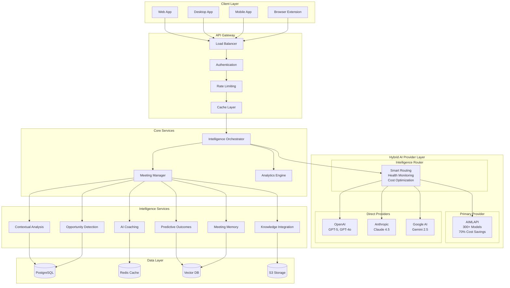
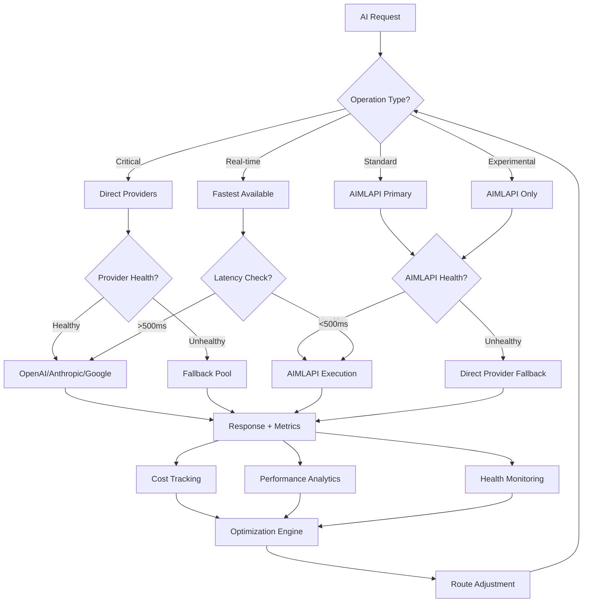
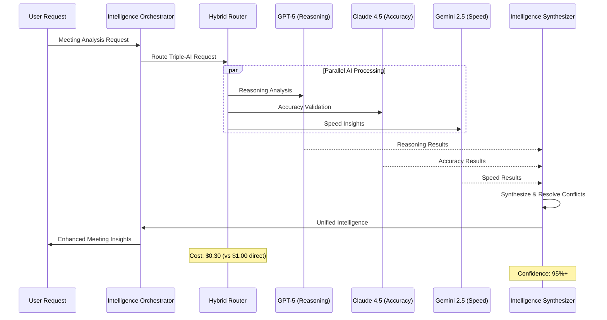
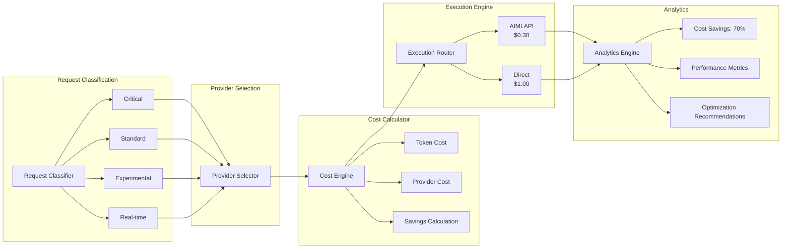
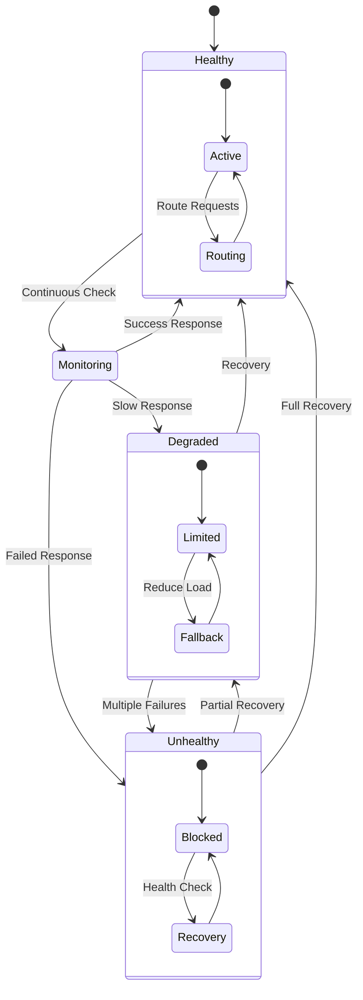
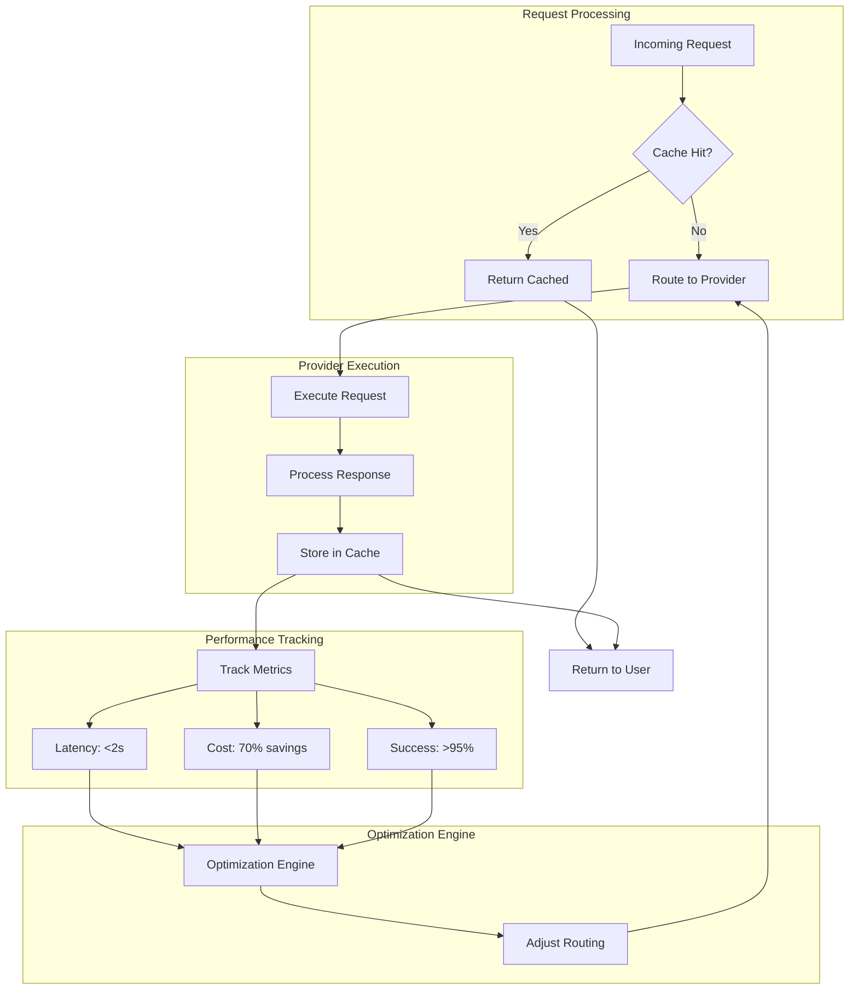
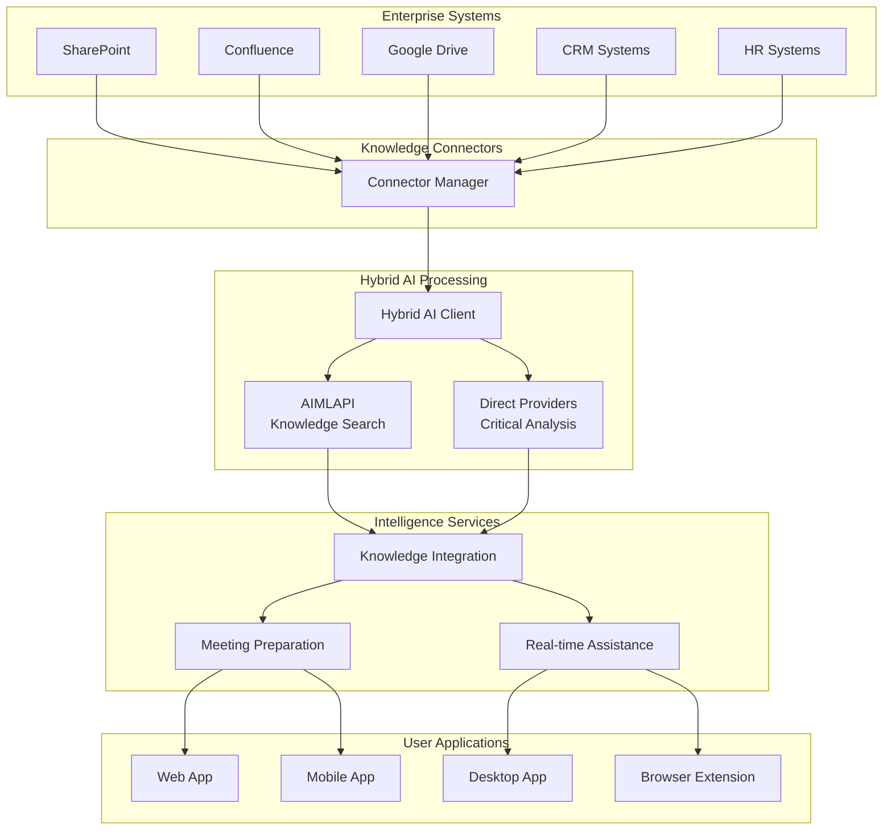

# MeetingMind Platform Architecture

## 1. Executive Summary

The MeetingMind platform is a sophisticated, AI-powered meeting and job interview intelligence platform. It leverages a revolutionary **Hybrid AI Provider Strategy** to deliver exceptional performance, reliability, and cost-efficiency. This document provides a comprehensive overview of the platform's architecture, from the client-facing applications to the core AI infrastructure.

## 2. System Overview

The platform is designed with a multi-layered architecture to ensure scalability, security, and maintainability. The following diagram illustrates the high-level system overview:

## 3. Hybrid AI Provider Architecture

The core of the MeetingMind platform is its innovative Hybrid AI Provider Architecture, which intelligently routes AI requests to the most appropriate provider based on factors like cost, performance, and criticality.

### 3.1. Intelligent Provider Routing

The following diagram illustrates the provider routing logic:

### 3.2. Provider Selection Matrix

| Operation Type | Primary Provider | Fallback Strategy | Use Case |
|---|---|---|---|
| **Critical** | Direct (OpenAI/Anthropic) | Multi-provider fallback | Real-time coaching, Enterprise demos |
| **Standard** | AIMLAPI | Direct provider backup | Meeting analysis, Knowledge integration |
| **Real-time** | AIMLAPI + Direct | Fastest available | Live coaching, Instant suggestions |
| **Experimental** | AIMLAPI | Cost-optimized only | R&D, Feature testing |
| **Batch** | AIMLAPI | Queue management | Bulk processing, Analytics |

## 4. Triple-AI Collaboration

MeetingMind employs a Triple-AI collaboration system to ensure the highest quality insights. This system leverages the strengths of three leading AI models:

*   **GPT-5:** Advanced reasoning and content generation.
*   **Claude 4.5 Sonnet:** Accuracy validation and safety.
*   **Gemini 2.5 Flash:** Speed and real-time processing.

### 4.1. Collaboration Flow

## 5. Cost Optimization

The Hybrid AI Provider Strategy is designed to deliver significant cost savings without compromising on quality or performance. This is achieved through a combination of intelligent routing, provider selection, and cost tracking.

### 5.1. Cost Optimization Architecture

## 6. Reliability and Performance

The platform is engineered for high reliability and performance, with a multi-layered approach to ensure uptime and low latency.

### 6.1. Health Monitoring System

### 6.2. Performance Optimization Flow

## 7. Enterprise Integration

MeetingMind is designed to integrate seamlessly with existing enterprise systems, providing a unified intelligence experience.

### 7.1. Enterprise Integration Architecture

## 8. Conclusion

The MeetingMind platform's architecture is a testament to our commitment to innovation and excellence. By combining a flexible, multi-layered design with a groundbreaking Hybrid AI Provider Strategy, we have created a platform that is not only powerful and feature-rich but also cost-effective and reliable. This architecture provides a solid foundation for future growth and development, ensuring that MeetingMind remains at the forefront of the AI-powered intelligence market.

