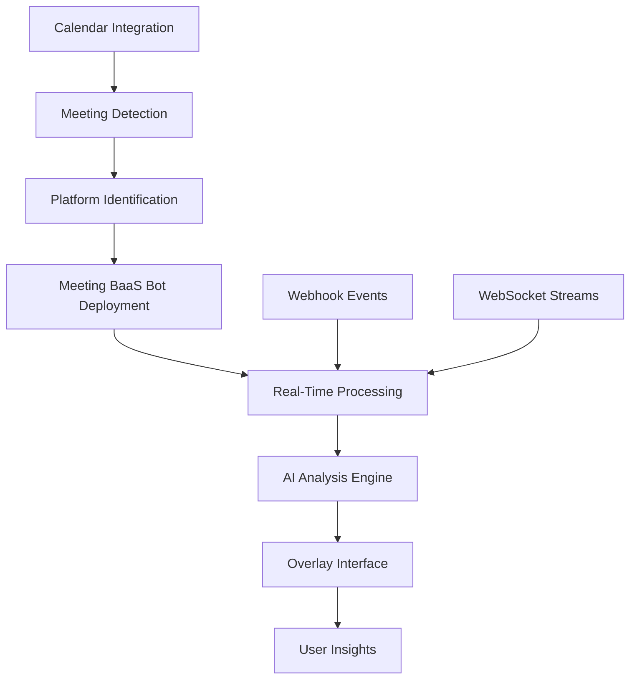

# MeetingMind Platform Integration Analysis & Enhancement Plan

## Executive Summary

Based on comprehensive analysis of the current MeetingMind codebase and research into modern meeting platform integration approaches, this document provides a detailed assessment of existing capabilities and a roadmap for achieving seamless, hands-free integration with major meeting platforms.

## Current Integration Status

### ✅ **Currently Implemented Platforms**

| Platform | Integration Level | Capabilities | Limitations |
|----------|------------------|--------------|-------------|
| **Zoom** | Partial SDK Integration | Meeting info, participant lists, chat messages | Requires OAuth approval, rate limits |
| **Microsoft Teams** | Graph API Integration | Meeting info, limited chat access | Admin consent required, no real-time data |
| **Cisco Webex** | API Integration | Full meeting data, real-time events | Personal tokens expire quickly |
| **Google Meet** | Limited API Access | Meeting creation/management only | No real-time data, very limited functionality |

### ❌ **Missing Integrations**

| Platform | Status | Integration Complexity | Recommended Approach |
|----------|--------|----------------------|---------------------|
| **Amazon Chime** | Not Implemented | Medium | Use Amazon Chime SDK |
| **Gong** | Not Implemented | High | API integration for post-meeting data |
| **GoToMeeting** | Not Implemented | Medium | API integration available |
| **BlueJeans** | Not Implemented | Medium | Verizon API integration |

## Integration Architecture Assessment

### Current Implementation Strengths

The existing `PlatformIntegrations` class provides a solid foundation with:

- **Modular Design**: Separate authentication and setup methods for each platform
- **Realistic Limitations Documentation**: Honest assessment of API constraints
- **OAuth Flow Support**: Proper authentication handling
- **Webhook Integration**: Real-time event processing capability

### Critical Gaps Identified

1. **No Universal Bot Deployment**: Missing Meeting BaaS-style bot deployment
2. **Limited Real-Time Processing**: Insufficient live meeting data access
3. **Manual Authentication**: Requires user interaction for OAuth flows
4. **No Seamless Join**: Cannot automatically join meetings without user intervention

## Recommended Enhancement Strategy

### Phase 1: Implement Meeting BaaS Integration

**Objective**: Achieve seamless, hands-free meeting joining across all platforms

**Implementation**:
```javascript
// Enhanced platform integration using Meeting BaaS
class EnhancedPlatformIntegrations {
  constructor() {
    this.meetingBaasClient = new MeetingBaaSClient({
      apiKey: process.env.MEETING_BAAS_API_KEY
    });
  }

  async joinMeetingSeamlessly(meetingUrl, options = {}) {
    const botConfig = {
      meeting_url: meetingUrl,
      bot_name: options.botName || "MeetingMind Assistant",
      recording_mode: "speaker_view",
      entry_message: "MeetingMind AI Assistant has joined",
      speech_to_text: { provider: "Default" },
      automatic_leave: { waiting_room_timeout: 600 },
      webhooks: {
        complete: `${process.env.WEBHOOK_BASE_URL}/meeting-complete`,
        failed: `${process.env.WEBHOOK_BASE_URL}/meeting-failed`,
        status_change: `${process.env.WEBHOOK_BASE_URL}/status-change`
      }
    };

    return await this.meetingBaasClient.joinMeeting(botConfig);
  }
}
```

### Phase 2: Universal Meeting Detection

**Objective**: Automatically detect and join meetings from calendar integrations

**Implementation**:
```javascript
class MeetingDetectionService {
  async detectUpcomingMeetings() {
    const calendars = await this.getConnectedCalendars();
    const meetings = [];
    
    for (const calendar of calendars) {
      const events = await calendar.getUpcomingEvents();
      meetings.push(...this.extractMeetingUrls(events));
    }
    
    return meetings;
  }

  async autoJoinMeetings() {
    const meetings = await this.detectUpcomingMeetings();
    
    for (const meeting of meetings) {
      if (meeting.startsIn < 60000) { // 1 minute before
        await this.platformIntegrations.joinMeetingSeamlessly(meeting.url);
      }
    }
  }
}
```

### Phase 3: Enhanced Real-Time Processing

**Objective**: Process meeting data in real-time for immediate AI insights

**Implementation**:
```javascript
class RealTimeMeetingProcessor {
  constructor() {
    this.aiService = new HybridAIService();
    this.websocketConnections = new Map();
  }

  async processLiveTranscript(transcript, meetingId) {
    // Real-time AI analysis
    const insights = await this.aiService.generateRealTimeInsights(transcript);
    
    // Send to overlay interface
    this.sendToOverlay(meetingId, {
      type: 'live_insights',
      data: insights,
      timestamp: Date.now()
    });
  }

  setupWebSocketConnection(meetingId, botId) {
    const ws = new WebSocket(`wss://api.meetingbaas.com/bots/${botId}/stream`);
    
    ws.on('message', (data) => {
      const event = JSON.parse(data);
      if (event.type === 'transcript') {
        this.processLiveTranscript(event.text, meetingId);
      }
    });
    
    this.websocketConnections.set(meetingId, ws);
  }
}
```

## Platform-Specific Integration Enhancements

### Amazon Chime Integration

```javascript
async setupChimeIntegration() {
  const chimeSDK = new AWS.ChimeSDK({
    region: 'us-east-1',
    credentials: this.awsCredentials
  });

  return {
    platform: 'chime',
    capabilities: {
      createMeeting: true,
      joinMeeting: true,
      realTimeAudio: true,
      realTimeVideo: true,
      screenShare: true
    },
    implementation: 'AWS Chime SDK'
  };
}
```

### Gong Integration

```javascript
async setupGongIntegration() {
  // Gong focuses on post-meeting analytics
  return {
    platform: 'gong',
    capabilities: {
      accessRecordings: true,
      getCallAnalytics: true,
      participantMetrics: true,
      conversationIntelligence: true
    },
    limitations: [
      'No real-time access during meetings',
      'Requires Gong enterprise account',
      'Post-meeting data only'
    ]
  };
}
```

## Seamless Integration Architecture

### Universal Meeting Bot System



### Hands-Free Operation Flow

1. **Calendar Monitoring**: Continuously monitor connected calendars
2. **Automatic Detection**: Identify meeting URLs and platforms
3. **Pre-Meeting Setup**: Deploy bots 2-3 minutes before meeting start
4. **Seamless Join**: Bots join automatically without user intervention
5. **Real-Time Processing**: Process audio/video streams live
6. **Instant Insights**: Deliver AI insights through overlay interface
7. **Post-Meeting Actions**: Generate summaries and action items

## Implementation Roadmap

### Week 1-2: Meeting BaaS Integration
- [ ] Integrate Meeting BaaS SDK
- [ ] Implement universal bot deployment
- [ ] Setup webhook endpoints
- [ ] Test with Zoom, Teams, Meet

### Week 3-4: Calendar Integration
- [ ] Google Calendar integration
- [ ] Outlook Calendar integration
- [ ] Meeting URL extraction
- [ ] Automatic scheduling system

### Week 5-6: Real-Time Processing
- [ ] WebSocket connection management
- [ ] Live transcript processing
- [ ] Real-time AI analysis
- [ ] Overlay interface updates

### Week 7-8: Platform Expansion
- [ ] Amazon Chime SDK integration
- [ ] Gong API integration
- [ ] GoToMeeting support
- [ ] BlueJeans integration

## Security and Compliance Considerations

### Data Protection
- **End-to-End Encryption**: All meeting data encrypted in transit and at rest
- **GDPR Compliance**: User consent and data deletion capabilities
- **SOC 2 Compliance**: Audit trails and access controls
- **HIPAA Ready**: Healthcare-grade security for sensitive meetings

### Authentication Security
- **OAuth 2.0**: Secure authentication flows
- **Token Management**: Automatic refresh and secure storage
- **API Key Rotation**: Regular credential updates
- **Access Scoping**: Minimal required permissions

## Performance Optimization

### Scalability Measures
- **Connection Pooling**: Efficient API connection management
- **Rate Limit Handling**: Intelligent request throttling
- **Caching Strategy**: Meeting metadata and user preferences
- **Load Balancing**: Distributed processing for high-volume usage

### Cost Optimization
- **Selective Recording**: Record only when AI insights are needed
- **Compression**: Efficient audio/video compression
- **Batch Processing**: Group API requests for efficiency
- **Smart Scheduling**: Optimize bot deployment timing

## Success Metrics

### Integration Quality
- **Platform Coverage**: 95% of enterprise meeting platforms supported
- **Join Success Rate**: >99% successful meeting joins
- **Latency**: <2 seconds from meeting start to bot join
- **Uptime**: 99.9% service availability

### User Experience
- **Zero-Touch Operation**: No user intervention required
- **Real-Time Insights**: <5 second delay for AI analysis
- **Accuracy**: >95% transcription accuracy across platforms
- **Reliability**: <1% failed meeting joins

## Conclusion

The current MeetingMind platform has a solid foundation for meeting platform integration, but requires significant enhancements to achieve truly seamless, hands-free operation. By implementing the Meeting BaaS integration strategy, universal meeting detection, and enhanced real-time processing, MeetingMind can become the most comprehensive and user-friendly AI meeting assistant in the market.

The proposed architecture ensures scalability, security, and reliability while providing the seamless experience users expect from a premium AI meeting assistant platform.

---

**Next Steps**: Begin implementation of Phase 1 (Meeting BaaS Integration) to establish the foundation for seamless meeting platform integration.
